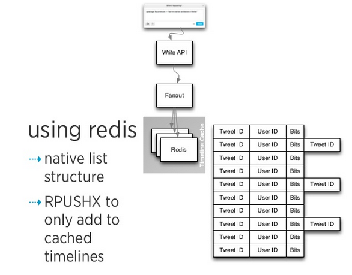
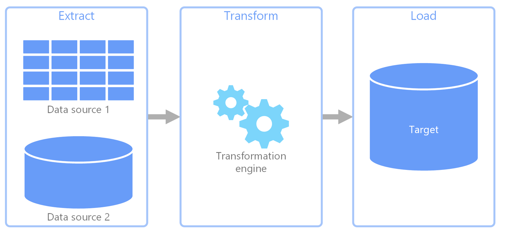

### Materialize Feed

> Simple Golang Restfull API for news feed app

##### Stack: 
* [Buffalo](buffalo.io)
* [PostgreSQL](postgresql.org)
* [Redis](postgresql.org)
* [Docker](postgresql.org)
* [Sentry](sentry.io)

##### Architecture

All new publications will be stored in a relational database and then cached in key-value database. 

The individual feed have the Fanout on Write architecture for scalability, as described in the image below.

The Fanout on Write architecture will be processed by a generic pipeline following the concept of an ETL (Extract, Transform and Load)





